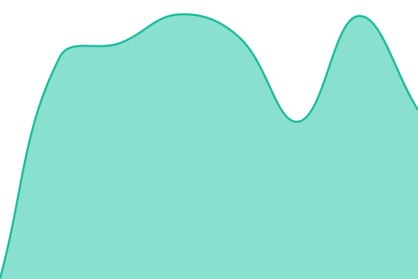
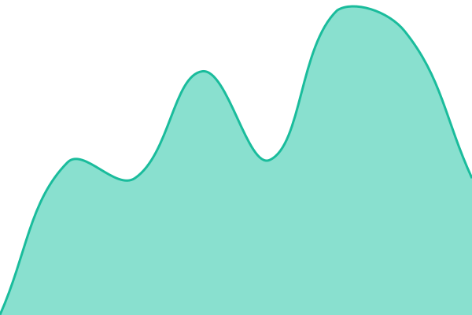

# RIN driftsstatus

Ekstern overvåkning av tjenestene til [RIN AS](https://rin.no), drevet av
[Upptime](https://upptime.js.org). Endepunktene sjekkes hvert femte minutt
fra GitHub Actions — utenfra, slik kundene når dem. Statussiden ligger på
[status.rin.no](https://status.rin.no).

Ved nedetid åpnes automatisk en issue i dette repoet, og den lukkes når
tjenesten er tilbake. Oppetidshistorikk og responstider ligger i
[`history/`](./history) og [`graphs/`](./graphs).

## Live status

<!--start: status pages-->
<!-- This summary is generated by Upptime (https://github.com/upptime/upptime) -->
<!-- Do not edit this manually, your changes will be overwritten -->
<!-- prettier-ignore -->
| URL | Status | History | Response Time | Uptime |
| --- | ------ | ------- | ------------- | ------ |
|  [Control plane](https://app.rin.no) | 🟩 Up | [control-plane.yml](https://github.com/soverein-it/upptime/commits/HEAD/history/control-plane.yml) | 

 774ms
     
 | 

<a href="https://status.rin.no/history/control-plane">100.00%</a>
    

|  [Git](https://git.rin.no) | 🟩 Up | [git.yml](https://github.com/soverein-it/upptime/commits/HEAD/history/git.yml) | 

 843ms
     
 | 

<a href="https://status.rin.no/history/git">100.00%</a>
    

|  [Webmail](https://mail.soverein.no) | 🟩 Up | [webmail.yml](https://github.com/soverein-it/upptime/commits/HEAD/history/webmail.yml) | 

 938ms
     
 | 

<a href="https://status.rin.no/history/webmail">100.00%</a>
    

|  [Mail submission (465)](mail.soverein.no) | 🟩 Up | [mail-submission-465.yml](https://github.com/soverein-it/upptime/commits/HEAD/history/mail-submission-465.yml) | 

 145ms
     
 | 

<a href="https://status.rin.no/history/mail-submission-465">100.00%</a>
    

|  [Mail IMAPS (993)](mail.soverein.no) | 🟩 Up | [mail-imaps-993.yml](https://github.com/soverein-it/upptime/commits/HEAD/history/mail-imaps-993.yml) | 

 144ms
     
 | 

<a href="https://status.rin.no/history/mail-imaps-993">100.00%</a>
    

|  [Collabora](https://wopi.soverein.no/hosting/discovery) | 🟩 Up | [collabora.yml](https://github.com/soverein-it/upptime/commits/HEAD/history/collabora.yml) | 

 961ms
     
 | 

<a href="https://status.rin.no/history/collabora">100.00%</a>
    

|  [NextCloud services](https://cc.rin.no/status.php) | 🟥 Down | [next-cloud-services.yml](https://github.com/soverein-it/upptime/commits/HEAD/history/next-cloud-services.yml) | 

 929ms
     
 | 

<a href="https://status.rin.no/history/next-cloud-services">98.40%</a>
    

|  [soverein.no](https://soverein.no/status.php) | 🟥 Down | [soverein-no.yml](https://github.com/soverein-it/upptime/commits/HEAD/history/soverein-no.yml) | 

 4316ms
     
 | 

<a href="https://status.rin.no/history/soverein-no">98.87%</a>
    

<!--end: status pages-->

## Drift

For internt driftsapparat (in-fleet-metrikker, alarmer, runbooks): se
rin-repoet — `infra/` og `docs/downtime/`. Dette er den eksterne vinkelen.

Listen over endepunkter vedlikeholdes i [`.upptimerc.yml`](./.upptimerc.yml).
